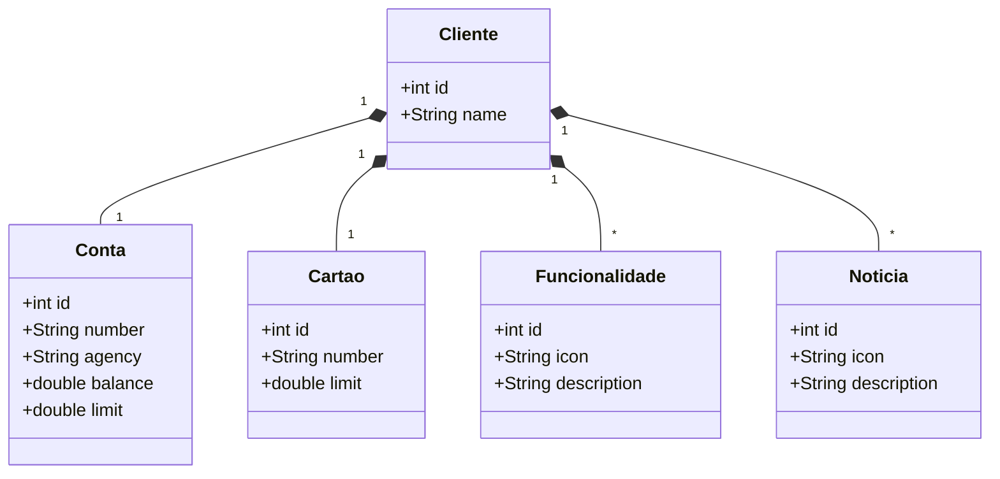

## Bradesco bootcamp 2025 Java Native.

# Diagrama de classes

```mermaid
classDiagram
    class Cliente {
        +int id
        +String name
    }

    class Conta {
        +int id
        +String number
        +String agency
        +double balance
        +double limit
    }

    class Cartao {
        +int id
        +String number
        +double limit
    }

    class Funcionalidade {
        +int id
        +String icon
        +String description
    }

    class Noticia {
        +int id
        +String icon
        +String description
    }

    Cliente "1" *-- "1" Conta
    Cliente "1" *-- "1" Cartao
    Cliente "1" *-- "*" Funcionalidade
    Cliente "1" *-- "*" Noticia


```

